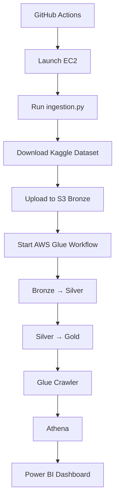

```mermaid
flowchart TD
    A[GitHub Actions]
    B[Launch EC2]
    C[Run ingestion.py]
    D[Download Kaggle Dataset]
    E[Upload to S3 Bronze]
    F[Start AWS Glue Workflow]
    G[Bronze → Silver]
    H[Silver → Gold]
    I[Glue Crawler]
    J[Athena]
    K[Power BI Dashboard]

    A --> B
    B --> C
    C --> D
    D --> E
    E --> F
    F --> G
    G --> H
    H --> I
    I --> J
    J --> K
```
